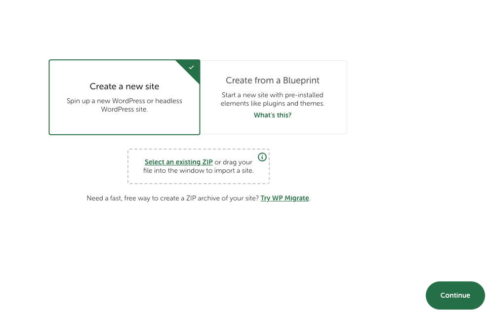
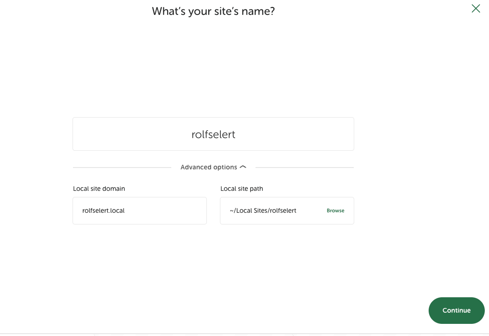
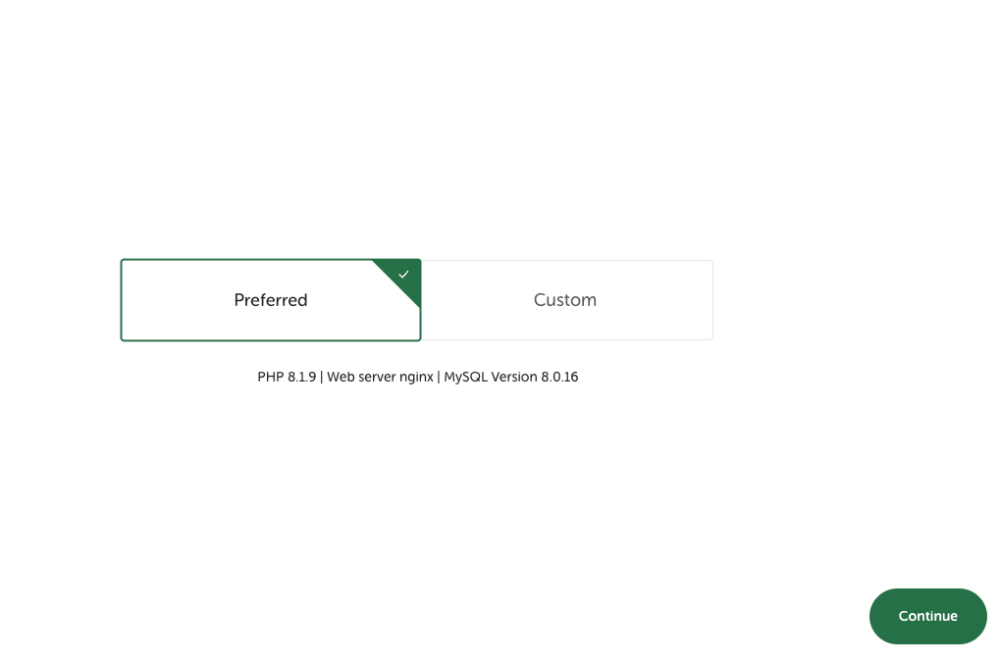
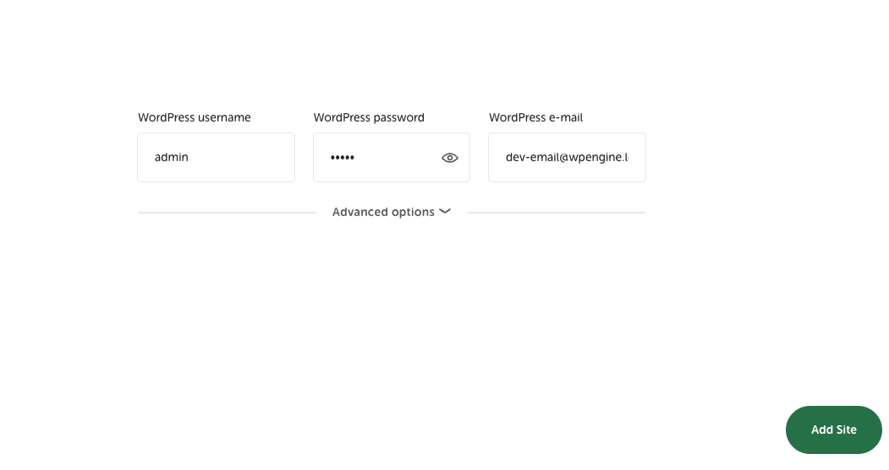
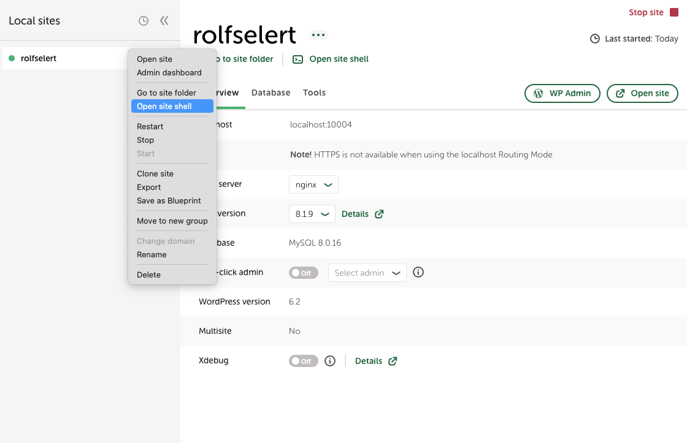
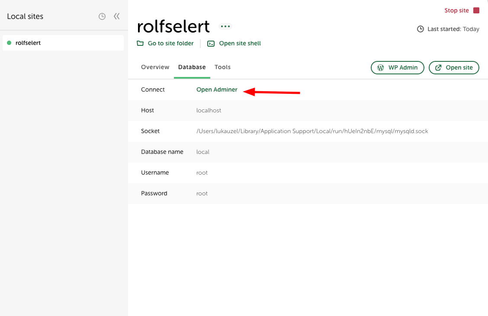
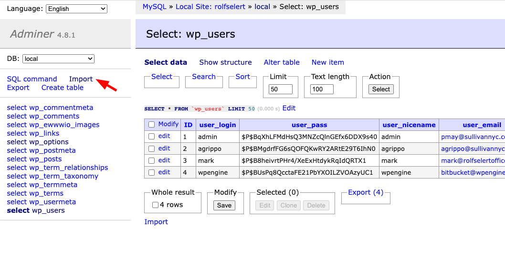

# Install

Installed on system with.

```
PHP 8.0.19
Node v12.22.12
Grunt v1.4.3
Ruby v2.6.10p210
Gem v3.0.3.1
```

To work localy use localwp.

Create new site in localwp. Folow steps.









Open shell.



Use CLI commands to clone GIT repository.

Remove or rename `wp-content` dir. 
```
mv wp-content/ wp-content.bak/
```

Clone this repo ad `wp-content` dir.
```
git clone git@github.com:bornfight/rolfselert-web-2023.git wp-content/
```

Now import SQL files using Adminer.

First unzip file `mysql.sql.zip`.





Now install Grunt task runner.

Go to `wp-content/themes/reo` dir and execute commands in order.

```
npm install -g grunt
sudo gem install sass
npm install
grunt 
```

# Develop

To run watcher execute command.

```
grunt
```

This is output.

```
➜  reo git:(master) ✗ grunt
Running "watch" task
Waiting...
>> File "scss/site.scss" changed.
Running "sass:dev" (sass) task

Running "cssmin:combine" (cssmin) task
File css/site.min.css created: 62.71 kB → 43.68 kB
File css/critical.min.css created: 9.88 kB → 7.4 kB

Done, without errors.
Completed in 2.017s at Wed Apr 05 2023 10:57:16 GMT+0200 (Central European Summer Time) - Waiting...
```
